<!-- Animated Header -->
<div align="center">
  
</div>

<!-- Typing Animation -->
<div align="center">
  <a href="https://git.io/typing-svg">
    
  </a>
</div>

<!-- Badges Row -->
<div align="center">

[](https://python.org)
[](https://fastapi.tiangolo.com)
[](https://playwright.dev)
[](https://sqlalchemy.org)

[](LICENSE)
[](CONTRIBUTING.md)
[](../../graphs/commit-activity)

<!-- Visitor Counter -->


</div>

<!-- Quick Links -->
<div align="center">
  <h3>
    <a href="#-quick-start">🚀 Quick Start</a>
    <span> · </span>
    <a href="#-features">✨ Features</a>
    <span> · </span>
    <a href="#-documentation">📚 Docs</a>
    <span> · </span>
    <a href="../../issues">🐛 Report Bug</a>
    <span> · </span>
    <a href="../../issues">💡 Request Feature</a>
  </h3>
</div>

<br/>

<!-- Animated Wave Separator -->


<br/>

<!-- About Section with Animated Icons -->
##  About The Project


**GovContracts Pro** is a comprehensive **Data-as-a-Service (DaaS)** platform that automates the collection, processing, and delivery of government contract opportunities.

### 🎯 **Why GovContracts Pro?**

- 🤖 **Automated 24/7** - Scrapes 50+ government sources hourly
- 🧹 **Clean Data** - Deduplicates and normalizes messy data
- ⚡ **Lightning Fast** - Find contracts in seconds, not hours
- 💰 **Revenue Ready** - Built-in subscription management
- 🔒 **Enterprise Security** - JWT + API Keys + Rate Limiting
- 📊 **Analytics Built-in** - Dashboard with real-time insights

<br clear="right"/>

---

## 🎯 The Problem We Solve

<table>
<tr>
<td width="50%">

### 😫 **Without GovContracts Pro**

```diff
- ⏰ 100+ hours/month manually searching
- 📊 Data fragmented across 50+ websites
- 🚫 Missing critical bid opportunities
- 💸 Paying for multiple subscriptions
- 📉 Inconsistent, messy data formats
- 🔄 Repetitive, error-prone work
```

</td>
<td width="50%">

### 😊 **With GovContracts Pro**

```diff
+ ⚡ < 5 minutes to find opportunities
+ 🎯 Single source of truth
+ 🔔 Never miss a contract again
+ 💰 One subscription, all data
+ 📈 Clean, normalized database
+ 🤖 Fully automated collection
```

</td>
</tr>
</table>

---

## ✨ Features

<div align="center">

### 🛠️ **Core Capabilities**

</div>

<table>
<tr>
<td align="center" width="33%">

### 🤖 Automated Scraping


24/7 intelligent data collection with rate limiting, retry logic, and browser automation

</td>
<td align="center" width="33%">

### 🔄 Smart Aggregation


Deduplication, normalization, and enrichment of contract data from multiple sources

</td>
<td align="center" width="33%">

### 🔍 Powerful Search


Full-text search with advanced filters: state, value, category, dates, and more

</td>
</tr>
<tr>
<td align="center" width="33%">

### 🔒 Enterprise Security


JWT + API Key authentication with role-based access control and rate limiting

</td>
<td align="center" width="33%">

### 📊 Analytics Dashboard


Real-time statistics, visual insights, and customizable reports

</td>
<td align="center" width="33%">

### 🚀 Developer API


RESTful API with comprehensive Swagger documentation

</td>
</tr>
</table>

---

## 🏗️ Architecture

```mermaid
graph TB
    subgraph "🌐 Data Collection Layer"
        S1[🇺🇸 SAM.gov Scraper]
        S2[🌴 California eProcure]
        S3[⭐ Texas SmartBuy]
        S4[🗽 New York Reporter]
        S5[➕ 46 More Sources...]
    end

    subgraph "⚙️ Processing Layer"
        SC[⏰ Scheduler<br/>APScheduler]
        AG[🔄 Aggregator<br/>Deduplication]
        DB[(🗄️ Database<br/>PostgreSQL)]
    end

    subgraph "🚀 Service Layer"
        API[🌐 REST API<br/>FastAPI]
        AUTH[🔐 Auth Service<br/>JWT + API Keys]
    end

    subgraph "👥 Client Layer"
        WEB[🖥️ Web Portal]
        SDK[📦 API Clients]
        HOOK[🔔 Webhooks]
    end

    S1 & S2 & S3 & S4 & S5 --> SC
    SC --> AG
    AG --> DB
    DB --> API
    AUTH --> API
    API --> WEB & SDK & HOOK

    style DB fill:#f9f,stroke:#333,stroke-width:2px
    style API fill:#bbf,stroke:#333,stroke-width:2px
    style SC fill:#ffd,stroke:#333,stroke-width:2px
```



---

## 🛠️ Tech Stack

<div align="center">


</div>

---

## 🚀 Quick Start

### Prerequisites

```bash
✅ Python 3.9+
✅ pip (Python package manager)
✅ Git
✅ 2GB RAM minimum
```

### ⚡ One-Command Setup

```bash
git clone https://github.com/Snapwave333/datta-Aggregator.git && cd datta-Aggregator && chmod +x setup.sh && ./setup.sh
```

<details>
<summary><h3>📝 Manual Installation (Click to Expand)</h3></summary>

#### Step 1: Clone Repository
```bash
git clone https://github.com/Snapwave333/datta-Aggregator.git
cd datta-Aggregator
```

#### Step 2: Setup Virtual Environment
```bash
python -m venv venv
source venv/bin/activate  # Windows: venv\Scripts\activate
```

#### Step 3: Install Dependencies
```bash
pip install -r requirements.txt
playwright install chromium
```

#### Step 4: Configure Environment
```bash
cp .env.example .env
nano .env  # Edit with your settings
```

#### Step 5: Initialize Database
```bash
python setup_sources.py
```

#### Step 6: Launch Services
```bash
# Terminal 1: API Server
python run_api.py

# Terminal 2: Scraper Scheduler
python run_scraper.py
```

#### Step 7: Access Application
| Service | URL |
|---------|-----|
| 🌐 Web Portal | http://localhost:8000/portal |
| 📚 API Docs | http://localhost:8000/docs |
| 🔧 ReDoc | http://localhost:8000/redoc |

</details>

---

## 📸 Screenshots & Demo

<div align="center">

### 📊 Dashboard View


*Real-time statistics and contract analytics*

### 🔍 Search Interface


*Advanced filtering with instant results*

### 📱 Responsive Design

Works perfectly on desktop, tablet, and mobile devices!

</div>

---

## 💻 API Usage Examples

<details>
<summary><h3>🔐 Authentication</h3></summary>

**Register User**
```bash
curl -X POST "http://localhost:8000/register" \
  -H "Content-Type: application/json" \
  -d '{
    "email": "contractor@company.com",
    "password": "SecurePass123!",
    "full_name": "John Builder",
    "company_name": "ABC Construction"
  }'
```

**Get Token**
```bash
curl -X POST "http://localhost:8000/token" \
  -H "Content-Type: application/x-www-form-urlencoded" \
  -d "username=contractor@company.com&password=SecurePass123!"
```

**Response:**
```json
{
  "access_token": "eyJhbGciOiJIUzI1NiIs...",
  "token_type": "bearer"
}
```

</details>

<details>
<summary><h3>🔍 Search Contracts</h3></summary>

**Basic Search**
```bash
curl -X GET "http://localhost:8000/contracts?keyword=construction" \
  -H "Authorization: Bearer YOUR_TOKEN"
```

**Advanced Filters**
```bash
curl -X GET "http://localhost:8000/contracts?\
keyword=infrastructure&\
state=California&\
min_value=500000&\
max_value=5000000&\
status=open&\
due_after=2024-06-01" \
  -H "Authorization: Bearer YOUR_TOKEN"
```

**Response:**
```json
{
  "total": 127,
  "page": 1,
  "page_size": 50,
  "contracts": [
    {
      "id": 1234,
      "title": "Highway Infrastructure Improvement Project",
      "agency": "California Department of Transportation",
      "estimated_value": 2500000,
      "due_date": "2024-07-15T17:00:00Z",
      "status": "open",
      "url": "https://caleprocure.ca.gov/...",
      ...
    }
  ]
}
```

</details>

<details>
<summary><h3>📊 Statistics</h3></summary>

```bash
curl -X GET "http://localhost:8000/statistics" \
  -H "X-API-Key: YOUR_API_KEY"
```

**Response:**
```json
{
  "total_contracts": 15847,
  "open_contracts": 3241,
  "closed_contracts": 12606,
  "by_state": {
    "Federal": 5234,
    "California": 3421,
    "Texas": 2891,
    "New York": 2156,
    "Florida": 1145
  },
  "by_source": {
    "SAM.gov": 5234,
    "Cal eProcure": 3421,
    "Texas SmartBuy": 2891,
    "NY Contract Reporter": 2156
  },
  "last_updated": "2024-11-17T15:30:00Z"
}
```

</details>

---

## 💰 Business Model & Pricing

<div align="center">

| 🆓 **FREE** | 🥉 **BASIC** | 🥈 **PRO** | 🥇 **ENTERPRISE** |
|:---:|:---:|:---:|:---:|
| **$0**/mo | **$49**/mo | **$99**/mo | **$299**/mo |
| 100 API calls/day | 1,000 API calls/day | 10,000 API calls/day | **Unlimited** |
| 50 results/query | 500 results/query | 2,000 results/query | **Unlimited** |
| Basic search | ✅ Email alerts | ✅ Webhooks | ✅ Custom scrapers |
| Limited history | ✅ CSV export | ✅ Priority support | ✅ SLA guarantee |
| Community support | ✅ Email support | ✅ Chat support | ✅ Dedicated manager |

</div>

### 💵 Revenue Potential

| Revenue Stream | Monthly Potential |
|----------------|------------------|
| 🔄 100 Basic Subscribers | $4,900 |
| 🥈 50 Pro Subscribers | $4,950 |
| 🥇 10 Enterprise Subscribers | $2,990 |
| **💰 Total MRR** | **$12,840** |

---

## 📁 Project Structure

```
📦 datta-Aggregator
├── 📂 src/                          # Source Code
│   ├── 📂 api/                      # 🚀 FastAPI REST API
│   │   ├── 🔐 auth.py               # Authentication & Authorization
│   │   ├── 🌐 main.py               # API Endpoints
│   │   └── 📋 schemas.py            # Pydantic Models
│   ├── 📂 models/                   # 🗄️ Database Models
│   │   ├── 📄 contract.py           # Contract Entity
│   │   ├── 📄 source.py             # Data Source Entity
│   │   └── 📄 user.py               # User & Subscriptions
│   ├── 📂 processors/               # ⚙️ Data Processing
│   │   ├── 🔄 aggregator.py         # Deduplication Logic
│   │   └── 🎯 scrape_manager.py     # Orchestration
│   ├── 📂 scrapers/                 # 🕷️ Web Scrapers
│   │   ├── 🏗️ base.py               # Base Classes
│   │   ├── 🇺🇸 sam_gov.py            # Federal Contracts
│   │   └── 🌍 state_portals.py      # State Scrapers
│   ├── 📂 utils/                    # 🛠️ Utilities
│   │   ├── 🔧 helpers.py            # Helper Functions
│   │   └── 📝 logger.py             # Logging Config
│   ├── ⚙️ config.py                 # Configuration
│   └── ⏰ scheduler.py              # Job Scheduling
├── 📂 frontend/                     # 🎨 Web Portal
│   ├── 🌐 index.html                # Main Template
│   ├── 🎨 styles.css                # Styling
│   └── ⚡ app.js                    # Frontend Logic
├── 📂 tests/                        # 🧪 Test Suite
├── 📂 data/                         # 💾 Database & Logs
├── 🚀 run_api.py                    # Start API Server
├── ⏰ run_scraper.py                # Start Scheduler
├── 🔧 setup_sources.py              # Initialize DB
├── 📋 requirements.txt              # Dependencies
└── 📖 README.md                     # You are here!
```

---

## 🔒 Security Features

<div align="center">

| Feature | Implementation | Status |
|---------|---------------|--------|
| 🔐 Password Hashing | bcrypt with salt | ✅ Active |
| 🎟️ Token Authentication | JWT with expiration | ✅ Active |
| 🔑 API Key Support | Unique keys per user | ✅ Active |
| 🚦 Rate Limiting | Per-user quotas | ✅ Active |
| 🛡️ Input Validation | Pydantic schemas | ✅ Active |
| 📝 Audit Logging | All actions tracked | ✅ Active |
| 🔒 CORS Protection | Configurable origins | ✅ Active |

</div>

---

## 🐳 Docker Deployment

<details>
<summary><h3>🚀 Production-Ready Setup (Click to Expand)</h3></summary>

**docker-compose.yml**
```yaml
version: '3.8'

services:
  api:
    build: .
    ports:
      - "8000:8000"
    environment:
      - DATABASE_URL=postgresql://daas:securepass@db/contracts
    depends_on:
      - db
    restart: unless-stopped
    healthcheck:
      test: ["CMD", "curl", "-f", "http://localhost:8000/"]
      interval: 30s
      timeout: 10s
      retries: 3

  scraper:
    build: .
    command: python run_scraper.py
    environment:
      - DATABASE_URL=postgresql://daas:securepass@db/contracts
    depends_on:
      - db
    restart: unless-stopped

  db:
    image: postgres:15-alpine
    volumes:
      - pgdata:/var/lib/postgresql/data
    environment:
      - POSTGRES_USER=daas
      - POSTGRES_PASSWORD=securepass
      - POSTGRES_DB=contracts
    restart: unless-stopped

volumes:
  pgdata:
```

**Deploy:**
```bash
docker-compose up -d --build
```

</details>

---

## 🗺️ Roadmap

<div align="center">

| Phase | Feature | Status |
|-------|---------|--------|
| 1️⃣ | Core scraping framework | ✅ Complete |
| 1️⃣ | REST API with auth | ✅ Complete |
| 1️⃣ | Web portal & search | ✅ Complete |
| 1️⃣ | Subscription management | ✅ Complete |
| 2️⃣ | Email notifications | 🔄 In Progress |
| 2️⃣ | Advanced analytics | 📋 Planned |
| 3️⃣ | ML contract matching | 📋 Planned |
| 3️⃣ | Mobile application | 📋 Planned |
| 4️⃣ | Slack/Teams integration | 🔮 Future |
| 4️⃣ | Auto bid generation | 🔮 Future |

</div>

---

## 🤝 Contributing

<div align="center">

**We love contributions! Here's how you can help:**

[](../../issues)
[](../../pulls)

</div>

### Quick Contribution Guide

1. 🍴 **Fork** the repository
2. 🌿 **Create** feature branch: `git checkout -b feature/AmazingFeature`
3. 💻 **Commit** changes: `git commit -m 'Add AmazingFeature'`
4. 📤 **Push** to branch: `git push origin feature/AmazingFeature`
5. 🔃 **Open** Pull Request

### 🎯 Priority Areas

- 🌍 **New Scrapers** - Add more government sources
- 🎨 **UI/UX** - Improve frontend design
- 📊 **Analytics** - Add visualization features
- 🧪 **Testing** - Increase code coverage
- 📚 **Documentation** - Improve guides

---

## 📜 License

<div align="center">

Distributed under the **MIT License**. See `LICENSE` for more information.

[](LICENSE)

</div>

---

## 🙏 Acknowledgements

<div align="center">

Special thanks to these amazing projects:

[](https://fastapi.tiangolo.com/)
[](https://playwright.dev/)
[](https://sqlalchemy.org/)
[](https://docs.pydantic.dev/)

</div>

---

<div align="center">

## ⭐ Star History

[](https://star-history.com/#Snapwave333/datta-Aggregator&Date)

</div>

---

<div align="center">

### 🌟 **If you find this project useful, please consider giving it a star!**

[](../../stargazers)
[](../../network/members)
[](../../watchers)

</div>

---

<!-- Animated Footer -->
<div align="center">
  
</div>

<div align="center">

**Built with ❤️ for the Government Contracting Community**

*"Transforming procurement chaos into business opportunity"*

<br/>

**[⬆ Back to Top](#)**

</div>
